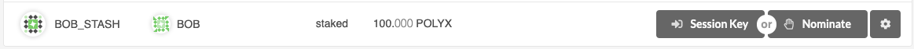
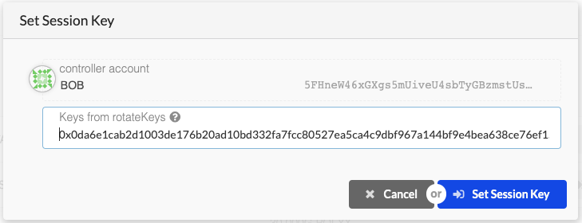
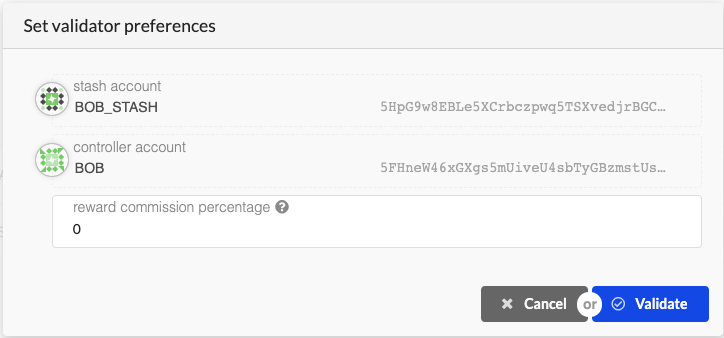

# Polymesh Operator - Overview

### **Strictly Confidential**

## About
Copyright © 2020 Polymath Inc. All Rights Reserved.

No part of this manual, including the products and software described in it, may be reproduced,
transmitted or transcribed to a third-party, or translated into any language in any form or by any
means without the express written permission of Polymath Inc. (“Polymath”).

THIS MANUAL IS PROVIDED “AS-IS” WITHOUT WARRANTY OF ANY KIND, EITHER EXPRESS OR
IMPLIED, INCLUDING BUT NOT LIMITED TO THE IMPLIED WARRANTIES OR CONDITIONS OF
COMPLETENESS, ACCURACY, MERCHANTABILITY OR FITNESS FOR A PARTICULAR PURPOSE. IN
NO EVENT SHALL POLYMATH, ITS AFFILIATES OR ANY OF THEIR DIRECTORS, OFFICERS,
EMPLOYEES OR AGENTS BE LIABLE FOR ANY INDIRECT, SPECIAL, INCIDENTAL OR
CONSEQUENTIAL DAMAGES (INCLUDING DAMAGES FOR LOSS OF PROFITS, LOSS OF BUSINESS,
LOSS OF USE OR DATA, INTERRUPTION OF BUSINESS AND THE LIKE), EVEN IF POLYMATH HAS
BEEN ADVISED OF THE POSSIBILITY OF SUCH DAMAGES ARISING FROM ANY DEFECT OR ERROR
IN THIS MANUAL.

Specifications and information contained in this manual are furnished for informational use only,
and are subject to change without notice, and should not be construed as advice by Polymath.
Recipient must obtain their own professional or specialist advice before taking, or refraining from,
any action on the basis of the information contained in this manual. Polymath assumes no
responsibility or liability for any errors or inaccuracies that may appear in this manual.

Polymath assumes no responsibility or liability for any errors or inaccuracies that may appear in
this manual and gives no undertaking, and is under no obligation, to update this document if any
errors or inaccuracies become apparent. The information in this document has not been
independently verified.

## Introduction

Operators perform critical functions for the network, and as such, have strict uptime requirements.
This document contains information about the recommended setup and maintenance of a
Polymesh operator node. The intended audience for this document is the operator’s IT team,
however, some business considerations were included for completeness and to provide the
operator’s IT team with the necessary context.


## Governance

Polymesh is a permissioned network meaning potential operators must go through a governance
process in order to be permissioned to work with the Polymesh network. The governance process
is on-chain and managed via the Polymesh Improvement Proposal (PIP) mechanism.

## Bonding POLYX

To become an operator on Polymesh, you need to bond (lock) a minimum of 5 million POLYX in the
system. This facilitates the economic incentives that the security of Polymesh relies on. The
account that stores your bonded POLYX is called your Stash account and the account that decides
what to do with the bonded POLYX is called your Controller account. Rewards that are generated
for running an operator node can be paid to the Stash account or another specified account.

Note that you do not need to bond all of the POLYX in your Stash account and you can always
bond more POLYX later. However, withdrawing any bonded POLYX requires to wait for the duration
of the unbonding period, which is currently 28 days.

## Network Architecture

The recommended secure operator setup for `mainnet` consists of the following:

* A firewalled (both ingress and egress) active operator node
* A warm spare operator node
* Two or more Internet-facing sentry nodes

The operator node needs to only connect with its sentry nodes.

Sentry nodes are essentially full archive nodes that act as the gatekeeper between your operator
node and the outside world. This setup is intended to isolate the operator node from public
networks, mitigating the risk of a DDoS and other attacks on your operator node.

The operator and sentry nodes do not need to be co-located, but the network between the nodes
should be secured and should allow two-way traffic between the sentries and operators. This may
be achieved via solutions like firewalls, VPN, or a cloud provider’s private networking and peering
solutions. Traffic encryption is preferred but not required.

A *minimum* recommended `testnet` setup would include one operator node and one sentry node.

## High Availability

### Sentry Nodes

The internet-facing sentry nodes should be highly available. An operator node should have at least
two sentry nodes. Two or more operator nodes may share their sentry nodes, but the amount of sentry
nodes should be scaled to provide sufficient redundancy / load balancing / DDoS protection for their assigned
operator nodes.

An operator node needs at least one sentry online at all times so you must make
sure that your sentry nodes are highly available. You can set up as many active sentry nodes for
your operator nodes as you like.

### Operator Node

Operators provide critical services to the network and are expected to maintain nearly continuous
uptime \[[1](#operator-node-notes)\]. However, it is imperative that only one operator node is active per operator. If multiple
operator nodes for a single operator do end up online at the same time, they may end up signing
multiple conflicting blocks and will thus get penalized for equivocation (see definition at end of
document). We recommend that you have a primary operator and a secondary one that acts as
failover and only becomes active if the primary operator goes down.

It is recommended that you use different session keys for different instances of operator nodes. If
the primary operator node goes down for some reason, the controller will need to change the
active session keys on the blockchain for the secondary node to become active. Since a key
change takes effect only in the next session, you may still get penalized for being offline for one
session if your primary node went down without producing any blocks in that session.

It is not recommended that you store your controller keys on a server for the automated signing of
the key change transaction. However, you can pre-sign an immortal transaction (a transaction
without a timeout) and store the signed transaction on a server that will broadcast it if the primary
node goes down. Please see the Upgrading/Replacing your operator node section for more details.

An alternative way of setting up high availability of the operator node is to use the same session
keys on both operator nodes. In that case, you must make sure that only one operator node is
actively operating with the --operator option and when you switch to your secondary node, you
must make sure that your primary node does not come back online without switching off the
secondary node. In this setup, there's a risk of equivocation if failover is not configured correctly
both nodes can become active at the same time. The penalty for equivocation is much higher than
the penalty for being offline. Therefore, this approach is not recommended.

#### Operator Node Notes

1. The network is resilient to temporary outages of operator nodes.  Any one operator
node may be down for a few minutes for upgrades, but should not have extended downtime lest they
risk getting slashed from the network.

## Key Management

There are three main types of keys that an operator must manage:

* session keys,
* controller key, and
* stash key.

The session keys are the only type of keys that the operator node needs access to. The other two
keys should be kept securely in a supported hardware wallet.

### Session keys

The session keys are the keys that an operator node uses to sign data needed for consensus.
These keys are stored on the operator node itself. Session keys don’t hold any funds but they can
be used to perform actions that will result in a penalty, like double signing. Hence, it is important to
keep these keys secure.

These keys can either be generated offline and injected in the operator node or can be generated
within the operator node. We recommend generating these keys within the operator node using
the provided RPC call so that these keys never leave the operator node.

In the future, Polymesh will support signing payloads outside the client so that keys can be stored
on another device, e.g. a hardware security module (HSM) or a secure enclave. For the time being,
however, session keys must be stored within the client.

### Controller key

The controller key is used to manage bonded funds, vote with bonded funds and do similar actions
on chain. This key is not directly needed by the operator node and hence must never be shared
with the operator node. It should be a multisig account or a supported hardware wallet. These keys
can hold funds and directly control funds bonded by the operator and therefore these should be
kept very securely. Consider these keys to be a semi-cold wallet.

### Stash key

This is the account where the operator rewards are sent. This should be a cold wallet, never
attached to the operator node.

## Resource requirements

The following resources should be allocated to each Polymesh node:

| Resource | Minimum Value | Recommended Value |
| ---------| --------------| ----------------- |
| CPU      | 2 CPU         | 4 CPU             |
| RAM      | 8 GB          | 8 GB              |
| Storage  | 80 GB SSD     | 100+ GB local NVMe SSD |

Please note that storage requirements will increase over-time. As such, adequate monitoring
measures should be put in place to ensure continued operations of the node.

## Telemetry

The health of a node can be assessed by monitoring the following parameters.

| Parameter | Operational Range | Additional Information |
| --------- | ----------------- | ---------------------- |
| Finalized Block number|+/- 3 from rest of the network|The block number for the rest of the network should be fetched from an external source.|
| Free disk space|30 GB+ or > 20% volume capacity|There should always be some free disk space for the Polymesh node to consume.|
| Free RAM|1 GB+|Spikes in RAM usage are acceptable but on average, there should be at least 1 GB of free RAM available on the system for the node to consume.|
| CPU usage|5-50% (overall)|This is the overall CPU usage and not per core usage. Occasional spikes above 50% are acceptable but more cores should be added if the CPU usage continuously stays above 50%.|
| Network connectivity|<1% packet loss|This mainly applies to sentry nodes. They should be online and reachable at all times. If they are being DDoS’d and can not respond to queries, new sentry nodes should be deployed.|
| Number of peers|# of expected connections for operators, minimum # for sentry nodes|An operator node should have a deterministic number of peers, a sentry should have a minimum number of peers (operators).|

## Upgrading / Replacing a node

### Sentry nodes

To upgrade a sentry instance, spawn a backup/replacement sentry instance first. Please see
setting up a sentry node guide for more details. The new sentry node should be connected to the
internet as well as your operator instance. Before proceeding, please make sure that your new
sentry node is connected to your operator node successfully.

Once your new sentry node is setup, stop the Polymesh client running on one of the old sentry
nodes, install the new version of Polymesh client and resume operation. Once the upgraded sentry
node has synchronized proceed to upgrade other sentry servers one by one. After you are done
upgrading all of your sentry nodes, you can safely decommission the temporary sentry node you
set up in the first step.

See “Polymesh Operator - Detailed Guide” for more details

### Operator node

First, you should upgrade your secondary/failover operator node. Since the secondary operator
node is not actively validating (assuming your primary node is working as intended), you can
simply stop the Polymesh client running on the secondary node, install the new Polymesh client
and then resume operation.

Once your secondary node is upgraded and fully synchronized, you should make your secondary
node active by submitting the change on the blockchain using your controller account.
To do so:

* go to Staking > Account Actions,
* click on "Set Session Key" against your bonding account,
* enter the output from author_rotateKeys in the field and click on "Set Session Key".

Please see setting up an operator node guide for more details on how to set up an operator node
and use the author_rotateKeys RPC call.

The change in operator session keys only applies in the next session. For safety, we recommend
that you wait at least 2 sessions before continuing. In other words, if the current session is N, you
should do the remaining steps in session N + 2.

Since your secondary operator is now acting as your active operator. You can safely take your
primary operator node offline and upgrade it.

Once you are done upgrading, you can simply mark this operator node as your failover node and
make your previous secondary operator node, your new primary node. In that case, you do not
need to do anything else at this moment.

Alternatively, you can make your newly upgraded node primary again. To do this, you need to
submit its session keys to the blockchain using your controller account. The process will be similar
to how you submitted your failover node's session keys to the blockchain.

See “Polymesh Operator - Detailed Guide” for more details

## Backing up a node

Since Polymesh is a public blockchain, you do not necessarily need to backup your nodes. You can
always synchronize from scratch.

However, it takes quite a bit of time to synchronize a node from scratch and hence you can choose
to backup the full blockchain DB regularly to be able to spin up new nodes faster.

## Stop being a Operator

To stop being an operator,

* go to Staking > Account Actions,
* click on "Stop Validating" against your bonding account.

You will be removed from the operator set in the next session. You can then safely terminate all
your operator and sentry nodes, remember failure to terminate safely may result in penalties.
Securing the instance

Best practices for securing your instances should be followed at all times. These include:

* disabling password-based SSH
* Setting up and enabling a firewall
* Only opening ports that are needed
* Disabling unnecessary services
* Not using the root user and disabling root login
* Keeping your system up to date
* Turning on SELinux
* Reviewing log files regularly

## Terminology

|Term|Definition|
|----|----------|
|Equivocation|When an operator node commits to two or more conflicting states.|
|Immortal Transaction|A transaction that is valid at any time.|
|Session|A session is a period of time that has a constant set of operators. Operators can only join or exit the operator set at a session change.|
|Era|An Era is a whole number of sessions. It is the period over which operator and nominator sets are calculated, and rewards paid out.|
|Operator Node|Operator nodes are permissioned network participants responsible for producing new blocks and finalising the block chain.|
|Sentry Node|Sentry nodes are full archive nodes which operator nodes use as a proxy to the wider network, limiting the operator nodes exposure to the public internet and providing data redundancy.|

# Polymesh Operator - Detailed Guide

## Overview

This guide will show how a Polymesh operator node can be set up. Please see “Polymesh Operator
- Overview” before continuing to get an overview of the architecture. This guide assumes that you
have already set up a VPN connection between the sentry nodes and the operator nodes.

## Getting the Polymesh node

You can directly build the latest release from source code. You can find the instructions on
https://github.com/PolymathNetwork/Polymesh

## Getting the identity of a Operator node

You need to execute the following command to start your operator and then copy the node's
identity. Once you have copied the identity, close the operator node.

```
./polymesh --operator
```

The above command will start the operator node and it will look something like

```
./polymesh --operator
2020-03-02 11:19:20 Polymesh Node
2020-03-02 11:19:20 version 2.0.0-a8676cab-x86_64-linux-gnu
2020-03-02 11:19:20 by Polymath, 2018-2020
2020-03-02 11:19:20 Chain specification: Local Testnet
2020-03-02 11:19:20 Node name: dirty-vase-9822
2020-03-02 11:19:20 Roles: AUTHORITY
2020-03-02 11:19:20 Local node identity is: QmZ1vCz7QpYsHMug7XLZynqKcueKVWWoTxFqBCRQ487YSr
2020-03-02 11:19:20 Starting BABE Authorship worker
2020-03-02 11:19:20 Grafana data source server started at 127.0.0.1:9955
```

From that, you can see your node's identity (QmZ1vCz7QpYsHMug7XLZynqKcueKVWWoTxFqBCRQ487YSr in this
case). Please save this for later and terminate the operator node.

You can also retrieve the node’s identity after starting it by querying the `system_networkState`
method on the node’s JSONRPC port and reading the result.peerId value, for example:

```
curl \
-s \
-H "Content-Type: application/json" \
-d '{"id":1, "jsonrpc":"2.0", "method": "system_networkState", "params":[]}' \
http://localhost:9933 \
| jq -r .result.peerId
```

## Telemetry Server

Details around telemetry are yet to be decided. A full guide with proper instructions will follow
later.

## Sentry Nodes

To run a sentry node, you will need to make use of the following options:

* `--sentry`: This parameter enumerates the operators to which the sentry will connect. Each
operator address uses libp2p format, for example
`/ip4/OPERATOR_IP_ADDRESS/tcp/30333/p2p/OPERATOR_PEER_ID`. Multiple operators can be
enumerated with a single `--sentry` parameter, provided that their addresses are separated with a
space.
* `--name`: Human-readable name of the nodes that is reported to the telemetry services.
* `--telemetry-url`: This provides the optional telemetry server to report the node stats and resource
usage. It requires a second parameter to specify the verbosity in the form or a number (0=lowest
verbosity, default=1)

Execute the following command to start a sentry node

```
./polymesh \
--name "Sentry-A" \
--sentry /ip4/OPERATOR_IP_ADDRESS/tcp/30333/p2p/OPERATOR_NODE_IDENTITY \
--telemetry-url ws://TELEMETRY_SERVER_IP:TELEMETRY_SERVER_PORT 0
```

Make sure to write down the identity of the sentry nodes as well.
It is recommended that you run at least two sentry nodes. To start your second sentry node, spin
up a new instance, download/build the Polymesh node on it and run

```
./polymesh \
--name "Sentry-B" \
--sentry /ip4/OPERATOR_IP_ADDRESS/tcp/30333/p2p/OPERATOR_NODE_IDENTITY \
--telemetry-url ws://TELEMETRY_SERVER_IP:TELEMETRY_SERVER_PORT 0
```

## Operator Nodes

To run an operator node, you need to use the --operator flag in the Polymesh node. You should
also use the --reserved-only flag so that the node only connects to the reserved trusted peers.
The following command will start a Polymesh operator node.

```
./polymesh \
--name "Operator" \
--operator \
--reserved-nodes /ip4/SENTRY_A_IP_ADDRESS/tcp/30333/p2p/SENTRY_A_NODE_IDENTITY \
/ip4/SENTRY_B_IP_ADDRESS/tcp/30333/p2p/SENTRY_B_NODE_IDENTITY \
--reserved-only \
--telemetry-url ws://TELEMETRY_SERVER_IP:TELEMETRY_SERVER_PORT
```

It is recommended that you also set up a failover operator node using the same config on a
different server. You can enumerate both operator addresses in the sentries or update the sentry
configuration at failover time.

Now you need to generate session keys for your operator. Run the following command on the
same machine to generate session keys for your operator.

```
curl -H "Content-Type: application/json" -d '{"id":1, "jsonrpc":"2.0", "method":
"author_rotateKeys", "params":[]}' http://localhost:9933
```

You will get an output similar to:

```
{"jsonrpc":"2.0","result":"0x2bd908203ae740b513f5907fdcc2e29a6bd2835618da917c03d2cfe65
d96745b54d59fe4dc5a106c130be0e677596eb023164c314d6fb5cc62ead1bcaee6a443fe5df859fc1de37
2580abaa98a22fee962bcff580bf57138adc12955aa698a5faa923978d9c16014205af96da9d2e213083ae
fcb53982927a2756ffa83d81658","id":1}
```

Take note of the “result” field. In example above, it is:

```
0x2bd908203ae740b513f5907fdcc2e29a6bd2835618da917c03d2cfe65d96745b54d59fe4dc5a106c130b
e0e677596eb023164c314d6fb5cc62ead1bcaee6a443fe5df859fc1de372580abaa98a22fee962bcff580b
f57138adc12955aa698a5faa923978d9c16014205af96da9d2e213083aefcb53982927a2756ffa83d81658
```

These are the public keys of your session keys. The private keys are stored in a keystore on your
operator server.

NOTE: Before proceeding to the final step that activates your operator node, please wait for all
your nodes to fully sync and make sure that everything has been set up properly.

## Auto restarting nodes

All your nodes should be run using services like systemd so that they are automatically restarted
when a failure happens or the server restarts. You are free to use alternatives but we’ll be using
systemd for this guide.

To get started, create a new systemd unit file called `polymesh-node.service` in
`/etc/systemd/system/`. You may use your favourite text editor, e.g.
`nano /etc/systemd/system/polymesh-node.service`

The following content should be in the unit file

```
[Unit]
Description=Polymesh Node
[Service]
ExecStart=PATH_TO_POLYMESH_BIN POLYMESH_FLAGS_MENTIONED_ABOVE
Restart=always
[Install]
WantedBy=multi-user.target
```

To enable this to autostart on bootup run:

```
systemctl enable polymesh-node.service
```

Start it manually with:

```
systemctl start polymesh-node.service
```

You can check the status of the service with:

```
systemctl status polymesh-node.service
```

## Other Configurations

It is recommended to cap the node’s memory use to 2/3rd of the system RAM or 6144MB,
whichever is greater. This can be achieved in systemd unit files with the MemoryLimit setting.
The `--db-cache` parameter to the polymesh binary can be used to improve the performance on
busy nodes. It is recommended that it be set no lower than the default of 128 (MiB), and that it be
capped at the lesser of 1/2 system RAM or `(system RAM - 4GiB)`.

## Bonding POLYX

To become an operator on Polymesh, you need to bond (lock) some POLYX in the system. The
account that stores your bonded funds is called the stash account and the account that decides
what to do with the bonded funds is called the controller account.

It is highly recommended that you make your controller and stash accounts be two separate
accounts. For this, you will create two accounts and make sure each of them has at least enough
funds to pay the fees for making transactions. Keep most of your funds in the stash account since
it is meant to be the custodian of your staking funds. Please note that for Alcyone Testnet you
can use the same account for the Stash account and the Controller account.

To bond your funds,

* go to the Staking section,
* click on "Account Actions",
* click on the "+”Stash” button.


* Stash account
  * Select your Stash account. In this example, we will bond 100 milli POLYX - make
    sure that your Stash account contains at least this much. You can, of course, stake
    more than this.
* Controller account
  * Select the Controller account created earlier. This account will also need a small
    amount of POLYX in order to start and stop validating.
* Value bonded
  * How much POLYX from the Stash account you want to bond/stake. Note that you
    do not need to bond all of the POLYX in that account. Also, note that you can
    always bond more POLYX later. However, withdrawing any bonded amount requires
    to wait for the duration of the unbonding period.
* Payment destination
  * The account where the rewards from validating are sent.
    Once everything is filled in properly, click Bond and sign the transaction with your Stash account.
    After a few seconds, you should see an "ExtrinsicSuccess" message. You should now see a
    new card with all your accounts (note: you may need to refresh the screen). The bonded amount
    on the right corresponds to the funds bonded by the Stash account.

##  Setting Session Keys

You need to tell the Polymesh blockchain what your session keys are. This is what associates your
operator with your Controller account. If you ever want to switch your operator node, you just need
to change your active session keys to the new session keys and wait for the change to become
active in the next session.

Remember the session keys we generated while setting up the operator node? It’s now time to use
those keys.

To set your Session Keys,

* go to the Staking section,
* click on "Account Actions",
* click on the "Session Key" button on the bonding account you generated earlier.
* enter the result of `author_rotateKeys` that we saved earlier in the field and click "Set Session Key",
* submit this extrinsic and you are now ready to start validating.





## Activating your Operator Node

Before moving forward, please make sure that everything is set up properly via the telemetry we
set up earlier. Once this step is complete, an improper setup may lead to penalties.

If everything looks good, go ahead and click on "Validate" in the UI.


Enter the reward commission percentage and click on Validate.



Congratulations! Your operator has been added in the queue and will become active in the next
session.
