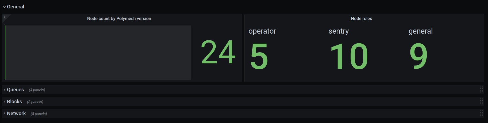
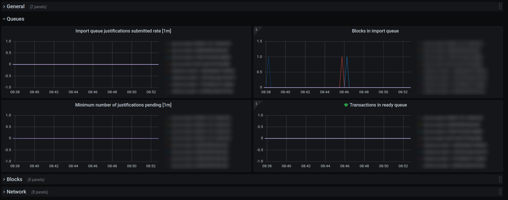
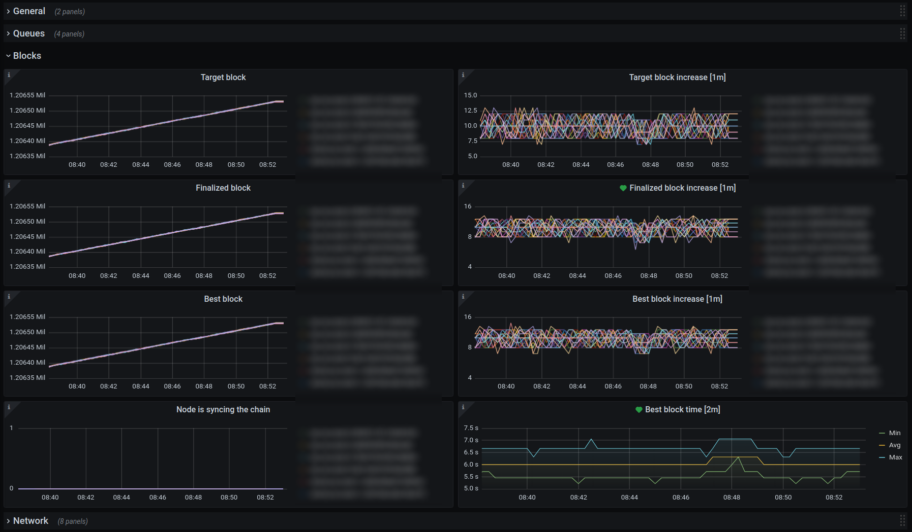
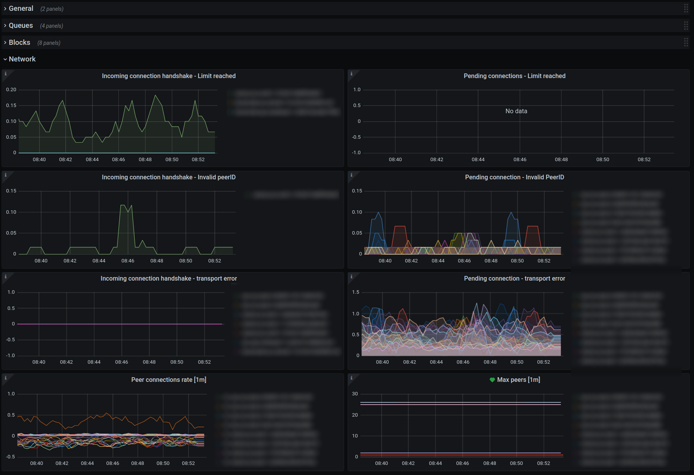

# Grafana dashboards for Polymesh

The `.json` files contained here can be [imported](https://grafana.com/docs/grafana/latest/dashboards/export-import/#importing-a-dashboard) into Grafana as dashboards.

## Polymesh Overview

This dashboard gives you an at-a-glance view of the Polymesh nodes you are monitoring.  It relies exclusively on the
Prometheus metrics exported by the Polymesh nodes.  Most graphs have a description indicating what they are monitoring
and how to interpret them.  The dashboard also includes some general alerts.  If you have a default notification
channel set up in Grafana then the alerts will be enabled by default.  If not you will have to configure the alerts
before you can use them.

